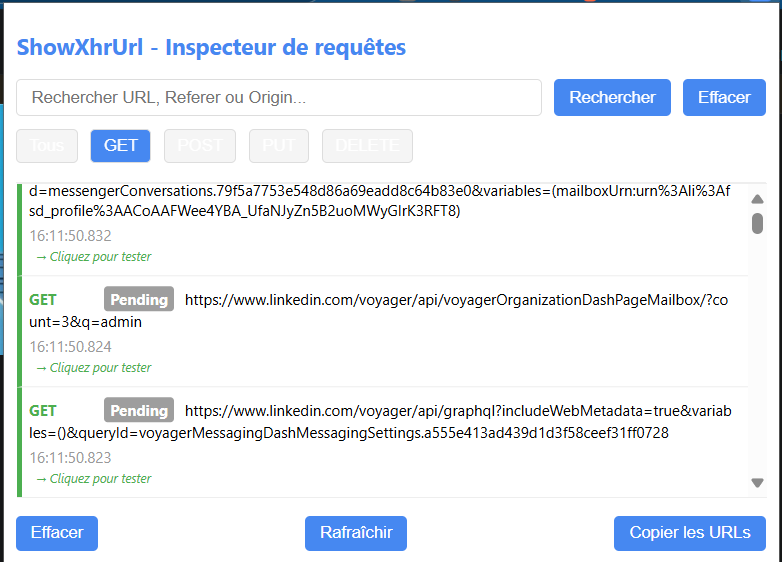

<div align="center">
<a href="">
    
</a>

<div align="center">
<a href="">
    
</a> 
</div>

</div>

```markdown
**Dépôt GitHub** : https://github.com/goddivor/show-xhr-url

Cette extension Chrome liste toutes les requêtes XHR du navigateur, triées par type (GET, POST, PUT, DELETE, etc.), et fournit une interface popup pour visualiser et filtrer ces appels en temps réel.
```

## 📁 Structure du projet

```
📁 .
│   📁 public
│   │   📁 icons
│   │   │   📄 Icon OR.png
│   │   │   📄 icon128.png
│   │   │   📄 icon16.png
│   │   │   📄 icon48.png
│   │   📄 vite.svg
│   📁 src
│   │   📁 background
│   │   │   📄 index.ts
│   │   📁 content
│   │   │   📄 index.ts
│   │   📁 popup
│   │   │   📄 index.html
│   │   │   📄 index.ts
│   │   📁 types
│   │   │   📄 axios.d.ts
│   │   📁 utils
│   │   │   📄 browser.ts
│   │   │   📄 cookies.ts
│   │   │   📄 index.ts
│   │   📄 counter.ts
│   │   📄 main.ts
│   │   📄 style.css
│   │   📄 typescript.svg
│   │   📄 vite-env.d.ts
│   📄 .gitignore
│   📄 .hintrc
│   📄 index.html
│   📄 manifest.json
│   📄 package-lock.json
│   📄 package.json
│   📄 README.md
│   📄 tsconfig.json
│   📄 vite.config.ts
```

## 🚀 Prérequis

- Node.js (>= 14)
- npm (>= 6)
- N'importe quel navigateur

## 🔧 Installation

1. Cloner le dépôt :

```
   git clone https://github.com/goddivor/show-xhr-url.git
   cd show-xhr-url
```

## 🔧 Installation

2. Renommer le fichier .env.example en .env et le replir comme suit :

```
    VITE_CHATGPT_API_KEY=Votre Clé API ChatGpt 
    VITE_CHATGPT_SPECIAL_PROMPT=Votre Prompt pour stringified le Json
    VITE_OPENAI_API_URL=L'Url de l'API de OpenAI 
    VITE_OPENAI_MODEL=Le type de model
    VITE_OPENAI_MAX_TOKENS=Token maximal
    VITE_OPENAI_TEMPERATURE=Température
```

3. Installer les dépendances :

   ```bash
   npm install
   ```

## ⚙️ Développement

Pour lancer l’extension en mode développeur avec rechargement à chaud :

```bash
npm run dev
```

Le dossier `dist/` sera mis à jour automatiquement à chaque modification.

## 📦 Build

Pour générer la version de production :

```bash
npm run build
```

Les fichiers optimisés seront disponibles dans `dist/`.

## 🔎 Charger l’extension dans Chrome

1. Ouvrez `chrome://extensions/` dans votre navigateur.
2. Activez le **Mode développeur** en haut à droite.
3. Cliquez sur **Charger l’extension non empaquetée**.
4. Sélectionnez le dossier `dist/`.
5. Vérifiez que l’icône et la popup fonctionnent correctement.

## 🤝 Contribution

Les contributions sont les bienvenues ! Ouvrez une issue ou soumettez un pull request.

---

_Développé avec ❤️ par l’équipe XHR Request Monitor Mdr 😂._
