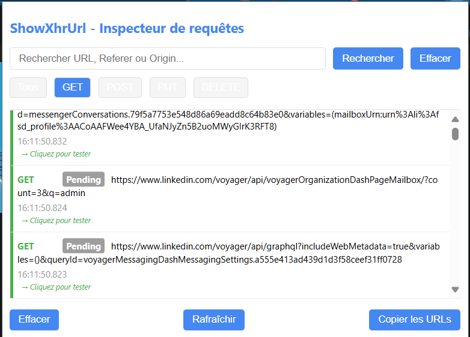

<div align="center">
<a href="">
    
</a>

<div align="center">
<a href="">
    
</a>
</div>

</div>

**GitHub Repository**: https://github.com/goddivor/show-xhr-url

This Chrome extension lists all XHR requests from the browser, sorted by type (GET, POST, PUT, DELETE, etc.), and provides a popup interface to visualize and filter these calls in real-time.

## Project Structure

```
.
├── public/
│   └── icons/
│       ├── Icon OR.png
│       ├── icon128.png
│       ├── icon16.png
│       └── icon48.png
├── src/
│   ├── background/
│   │   └── index.ts
│   ├── content/
│   │   └── index.ts
│   ├── popup/
│   │   ├── index.html
│   │   └── index.ts
│   ├── types/
│   │   └── axios.d.ts
│   └── utils/
│       ├── browser.ts
│       ├── cookies.ts
│       └── index.ts
├── manifest.json
├── package.json
├── tsconfig.json
└── vite.config.ts
```

## Prerequisites

- Node.js (>= 14)
- npm (>= 6)
- Any Chromium-based browser

## Installation

1. Clone the repository:

```bash
git clone https://github.com/goddivor/show-xhr-url.git
cd show-xhr-url
```

2. Rename `.env.example` to `.env` and fill it as follows:

```
VITE_CHATGPT_API_KEY=Your ChatGPT API Key
VITE_CHATGPT_SPECIAL_PROMPT=Your prompt for JSON stringification
VITE_OPENAI_API_URL=OpenAI API URL
VITE_OPENAI_MODEL=Model type
VITE_OPENAI_MAX_TOKENS=Maximum tokens
VITE_OPENAI_TEMPERATURE=Temperature
```

3. Install dependencies:

```bash
npm install
```

## Development

To run the extension in developer mode with hot reload:

```bash
npm run dev
```

The `dist/` folder will be automatically updated on each modification.

## Build

To generate the production version:

```bash
npm run build
```

Optimized files will be available in `dist/`.

## Load Extension in Chrome

1. Open `chrome://extensions/` in your browser.
2. Enable **Developer mode** in the top right corner.
3. Click **Load unpacked**.
4. Select the `dist/` folder.
5. Verify that the icon and popup work correctly.

## Features

- Real-time monitoring of all XHR/fetch requests
- Filter requests by HTTP method (GET, POST, PUT, DELETE, etc.)
- Search through captured requests
- View request/response headers
- Copy request URLs to clipboard
- Re-execute GET requests with CSRF token support
- JSON response simplification via ChatGPT integration (optional)

## Contributing

Contributions are welcome! Open an issue or submit a pull request.

## License

MIT
