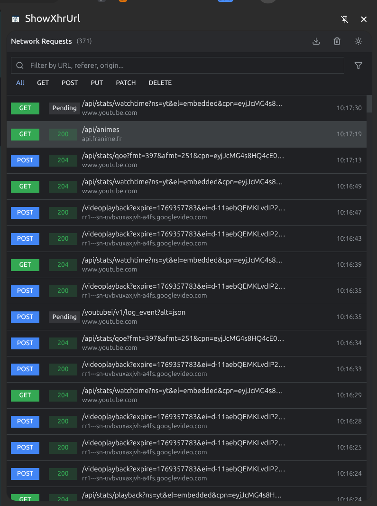
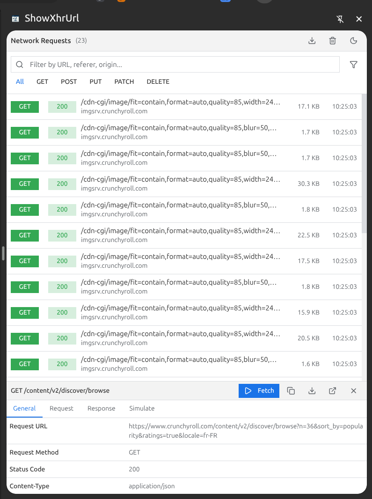
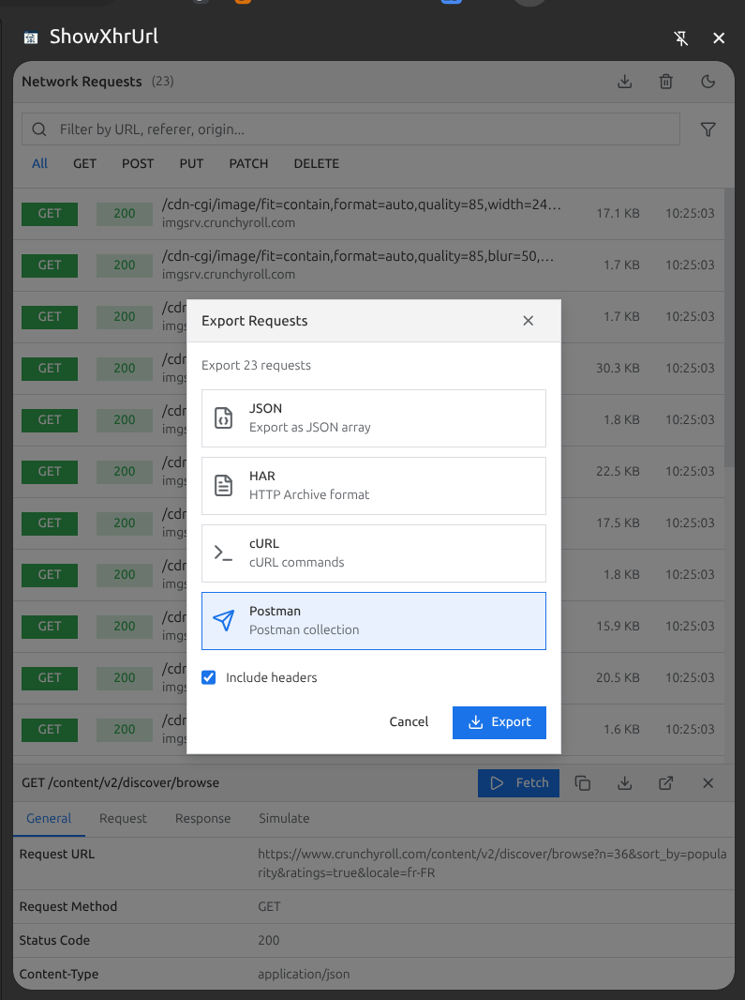
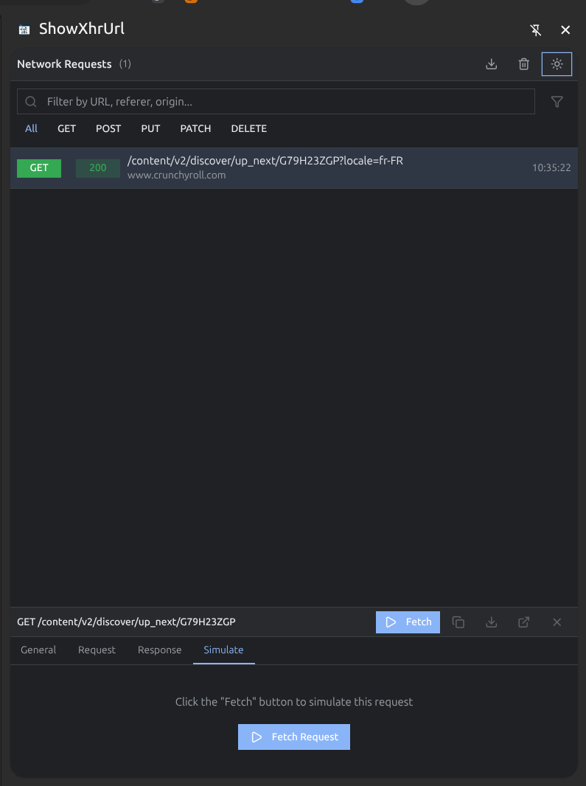

<div align="center">


# ShowXhrUrl v2

**A Chrome DevTools-style network request monitor**

Monitor, filter, simulate and export HTTP requests in real-time from any webpage.

[Features](#features) • [Installation](#installation) • [Usage](#usage) • [Screenshots](#screenshots)

</div>

---

## Features

- **Side Panel Interface** - DevTools-inspired design that stays open while browsing
- **Real-time Monitoring** - Capture all XHR, Fetch, and network requests instantly
- **Request Simulation** - Re-execute any captured request and view the response
- **Dark/Light Theme** - System preference detection with manual toggle
- **Advanced Filters** - Filter by method, status code, content type, request type
- **Multiple Export Formats** - JSON, HAR, cURL commands, Postman collections
- **Request Details** - View headers, request body, and response data

## Screenshots

<div align="center">

<table>
<tr>
<td align="center">
<strong>Dark Theme</strong><br/>

</td>
<td align="center">
<strong>Light Theme</strong><br/>

</td>
</tr>
<tr>
<td align="center">
<strong>Request Details &amp; Simulation</strong><br/>

</td>
<td align="center">
<strong>Export Options</strong><br/>

</td>
</tr>
</table>

</div>

## Installation

### From Source

1. Clone the repository:
```bash
git clone https://github.com/goddivor/show-xhr-url.git
cd show-xhr-url
git checkout v2
```

2. Install dependencies:
```bash
npm install
```

3. Build the extension:
```bash
npm run build
```

4. Load in Chrome:
   - Open `chrome://extensions/`
   - Enable **Developer mode**
   - Click **Load unpacked**
   - Select the `dist/` folder

## Usage

1. Click the extension icon to open the side panel
2. Browse any website - requests will appear automatically
3. Use filters to narrow down requests (method, status, type)
4. Click any request to view details
5. Click **Fetch** to simulate/re-execute the request
6. Export requests using the download button

### Keyboard Shortcuts

- Click extension icon → Opens side panel
- Theme toggle → Top right corner

## Tech Stack

- **Framework**: React 18 + TypeScript
- **Styling**: Tailwind CSS v4
- **State**: Zustand
- **Build**: Vite + vite-plugin-web-extension
- **Icons**: Lucide React

## Project Structure

```
src/
├── background/          # Service worker for request capture
├── sidepanel/           # React application
│   ├── components/      # UI components
│   ├── hooks/           # Custom React hooks
│   ├── stores/          # Zustand state management
│   ├── lib/             # Utilities (export, simulation)
│   └── styles/          # Global CSS
├── content/             # Content script
└── utils/               # Shared utilities
```

## Development

```bash
# Development mode with hot reload
npm run dev

# Production build
npm run build

# Type checking
npm run typecheck
```

## Contributing

Contributions are welcome! Open an issue or submit a pull request.

## License

MIT
